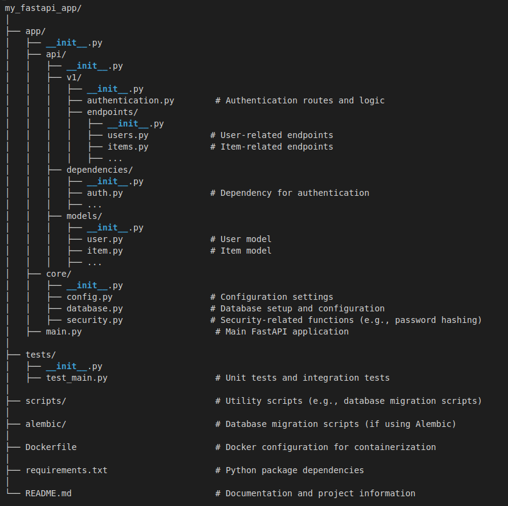

### Inference pipeline using FastAPI, docker and kubernetes

This project is a simple example of how to deploy a machine learning model using FastAPI, docker and kubernetes.
The app follows the following structure:

